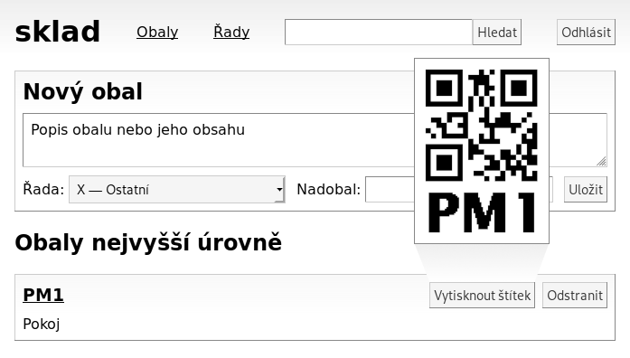

sklad
=====

'sklad' is a simple personal warehouse management system or, let's rather say,
"stuff management system", employing a web UI for easy mobile access from
a smartphone.  The templates are currently localised only in the Czech language.

The project also contains reusable Go packages with a Brother QL-series USB
printer driver and a simple BDF bitmap font renderer, as well as a few related
utilities for previewing, printing and debugging.

Building and Running
--------------------
Build dependencies: Go +
Runtime dependencies: Linux, a Brother QL label printer connected over USB

 $ go get -u https://janouch.name/sklad/cmd/sklad

You will need to bootstrap the database by writing a minimal 'db.json':
....
{
	"Password": "login-password",
	"Prefix": "A",
	"BDPPath": "font.bdf",
	"BDFScale": 3
}
....

Decent Unicode fonts in the BDF format can be obtained from
https://www.cl.cam.ac.uk/~mgk25/ucs-fonts.html
though they will need some upscaling because of the printer's high DPI.

After placing the templates and the BDF font file in the current working
directory, run the application as follows:

 $ sklad :8000 db.json

Contributing and Support
------------------------
Use https://git.janouch.name/p/sklad to report any bugs, request features,
or submit pull requests.  `git send-email` is tolerated.  If you want to discuss
the project, feel free to join me at ircs://irc.janouch.name, channel #dev.

Bitcoin donations are accepted at: 12r5uEWEgcHC46xd64tt3hHt9EUvYYDHe9

License
-------
This software is released under the terms of the 0BSD license, the text of which
is included within the package along with the list of authors.
